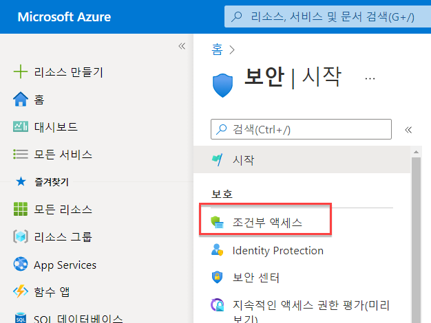
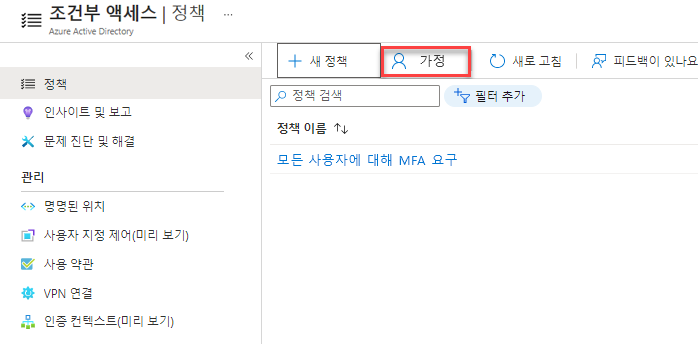
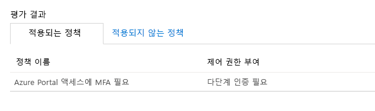

# 모듈 3 - 랩 1 - 연습 1 - MFA 인증 파일럿(Azure Active Directory 조건부 액세스를 사용하여 특정 앱에 MFA를 사용해야 하도록 설정)

### 작업 1: 조건부 액세스 정책 만들기 

이 랩에서는 특정 사용자가 MFA를 사용해야 하도록 설정하려면 필요한 조건부 액세스 정책을 만드는 방법을 살펴봅니다. 이 시나리오에서 사용되는 항목은 다음과 같습니다.

- MFA를 요구하는 클라우드 앱의 자리 표시자로 사용할 Azure Portal. 
- 조건부 액세스 정책을 테스트할 샘플 사용자.  

정책에서 다음을 설정합니다.

|설정 |값|
|---     | --- |
|개요 | Patti Fernandez |
|클라우드 앱 | Microsoft Azure 관리 |
|액세스 권한 부여 | 다단계 인증 필요 |

 
1.  암호를 `Pa55w.rd`를 사용하여 Azure Portal(`https://portal.azure.com`)에 Holly Dickson으로 로그인합니다.

2.  Azure Portal의 허브 메뉴에서 **Azure Active Directory** 로 이동합니다. 필요한 경우 추가 서비스를 사용하여 Azure Active Directory를 검색합니다.

3. 왼쪽에서 **보안** 을 클릭하고 **조건부 액세스** 를 선택합니다.

     
 
5.  **조건부 액세스** 페이지의 위쪽 도구 모음에서 **새 정책** 을 클릭한 다음 **새 정책 만들기** 를 선택합니다.

    **참고**: 이 옵션이 회색으로 표시되면 브라우저 세션을 새로 고치세요.

6.  **새로 만들기** 페이지의 **이름** 텍스트 상자에 `Require MFA for Azure portal access`를 입력합니다.

7.  **할당** 섹션에서 **0명의 사용자 또는 워크로드 ID가 선택됨** 을 클릭합니다.

8.  **사용자 및 그룹** 페이지에서 다음 단계를 수행합니다.

    a. **사용자 및 그룹 선택** 을 클릭한 다음, **사용자 및 그룹** 을 선택합니다.
    

    b. **선택** 페이지에서 `Patti Fernandez`을 선택한 다음, **선택** 을 클릭합니다.

9.  새 페이지로 돌아가서 **클라우드 앱 또는 작업** 섹션에서 **클라우드 앱, 작업 또는 인증 컨텍스트가 선택되지 않음** 을 클릭합니다.

10. **클라우드 앱 또는 작업** 페이지에서 다음 단계를 수행합니다.

    a. **앱 선택** 을 클릭합니다.

    b. **선택** 페이지에서 **Microsoft Azure 관리** 를 선택한 다음, **선택** 을 클릭합니다.

11.  **권한 부여** 의 아래의 **액세스 제어** 섹션에서 **컨트롤 0개 선택** 됨을 클릭합니다.

12.  **허용** 페이지에서 다음 단계를 수행합니다.
     1. **액세스 권한 부여** 를 선택합니다.
     2.  **다단계 인증 필요** 를 선택합니다.
     3.  **선택** 을 클릭합니다.

13.  **정책 사용** 섹션에서 **켬** 을 클릭합니다.

14.  **만들기** 를 클릭합니다.

    ‎**참고:** 정책 적용이 실패하면 작업 내용을 확인하고 **만들기** 를 다시 클릭합니다.

### 작업 2: 시뮬레이션된 로그인 평가

조건부 액세스 정책을 구성했으니, 예상대로 작동하는지 확인해야 합니다. 첫 번째 단계로, 조건부 액세스 what if 정책 도구를 사용하여 테스트 사용자 로그인을 시뮬레이션합니다. 이 시뮬레이션은 이 로그인이 정책에 미치는 영향을 평가하고, 시뮬레이션 보고서를 생성합니다.  

여기서는 다음 정보를 사용하여 가상 정책 평가 도구를 초기화합니다.

- 사용자: **Patti Fernandez** 
- 클라우드 앱으로 **Microsoft Azure 관리**

 **What If** 를 클릭하면 다음 내용을 보여주는 시뮬레이션 보고서가 작성됩니다.

- **적용되는 정책** 아래에 **Azure Portal에 액세스하려면 MFA 필요** 
- **권한 부여 컨트롤** 로 **Multi-Factor Authentication 필요**.

1.  조건부 액세스-정책 페이지 위쪽의 메뉴에서 **가상** 을 클릭합니다.  
 
     

2.   **워크로드 또는 사용자 ID** 에서 **선택한 사용자 없음** 을 클릭하고 `Patti Fernandez`를 선택한 다음 **선택** 을 클릭합니다.

3.  클라우드 앱을 선택하려면 다음 단계를 수행합니다.

    a. **클라우드 앱, 작업 또는 인증 컨텍스트** 페이지에서 **모든 클라우드 앱** 을 선택합니다.

    b. **앱 선택** 을 클릭합니다.

    c. **선택** 페이지에서 **Microsoft Azure 관리** 를 선택한 다음, **선택** 을 클릭합니다.

4.  가정 페이지에서 **가정** 을 선택합니다.

5.  결과로 "Azure Portal 액세스에 MFA 필요"가 표시되는지 확인합니다.

     

### 작업 3: 조건부 액세스 정책 테스트

이전 섹션에서는 시뮬레이션된 로그인을 평가하는 방법을 배웠습니다. 시뮬레이션 외에도, 조건부 액세스 정책이 예상대로 작동하는지 테스트해야 합니다. 

정책을 테스트하려면 InPrivate 브라우징 세션을 열고 **Patti Fernandez** 계정을 사용하여 Azure Portal **`https://portal.azure.com`** 에 로그인해 봅니다. 계정에 추가 보안 확인을 설정하라고 요구하는 대화 상자가 표시됩니다.

## 연습 2 계속 진행
