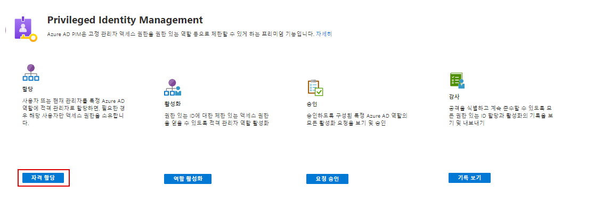
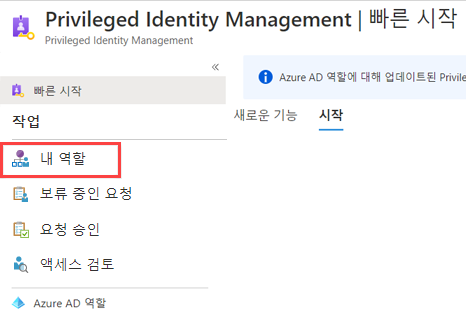
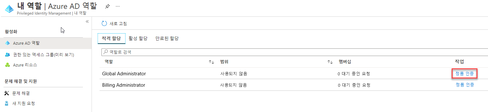
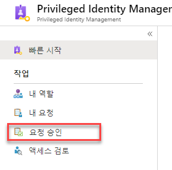
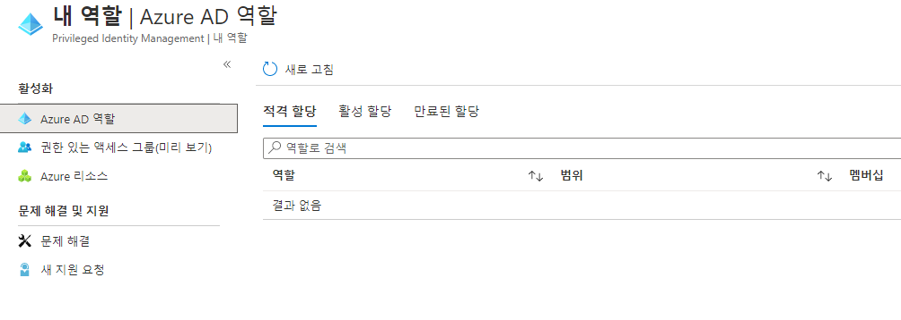

# 모듈 3 - 랩 2 - 연습 5 - PIM 리소스 워크플로

### 작업 1:  승인이 필요하도록 전역 관리자 역할 구성

1.  이전 연습에서 로그인했던 Holly로 로그인된 상태여야 합니다.  `Azure AD Privileged Identity Management`를 엽니다.

1.  **Azure AD 역할** 을 클릭합니다.

1.  **설정** 을 클릭합니다. 

1.  `Global Administrator`를 선택합니다.

1.  **편집** 을 클릭하고 아래쪽으로 스크롤하여 **활성화하려면 승인이 필요함** 를 선택합니다.  

2.  **승인자 선택** 을 클릭하고 승인자로 Holly Dickson을 할당한 후에 **선택** 을 클릭합니다.  그런 다음 **업데이트** 를 클릭합니다.

### 작업 2: Patti에 대해 전역 관리자 권한 활성화

1.  **Azure AD Privileged Identity Management** 를 엽니다.

1.  **Azure AD 역할** 을 클릭합니다.

1.  **빠른 시작** 을 클릭하고 **자격 할당** 을 선택합니다.

     

1.  **전역 관리자** 를 선택합니다.

1.  **+할당 추가** 를 선택하고 **멤버 선택** 에서 **Patti Fernandez** 를 선택합니다. **선택** 을 클릭합니다.

2.  **다음**, **할당** 을 차례로 클릭합니다.

1.  InPrivate 브라우징 세션을 열고 `https://portal.azure.com`로 로그인합니다.  이전 연습에서 사용했던 브라우저가 아직 열려 있을 수도 있습니다.

1.  **Azure AD Privileged Identity Management** 를 엽니다.

1.  **My Roles**(내 역할)를 선택합니다.

     

1.  전역 관리자 역할을 **활성화** 합니다.

     

1.  필요한 경우 마법사를 사용하여 Patti의 ID를 확인합니다.

1.  **Azure AD Privileged Identity Management** 의 **내 역할** 로 돌아옵니다.

1.  전역 관리자 역할 옆의 **활성화** 를 클릭합니다.

1.  활성화 이유로 **관리 작업을 수행해야 함** 을 입력하고 **활성화** 를 클릭합니다.

그러면 요청이 "승인 보류 중" 상태라는 알림이 표시됩니다.

### 작업 3: PIM에서 Azure 리소스 역할에 대한 요청 승인 또는 거부

Azure AD PIM(Privileged Identity Management)을 사용하면, 활성화에 대한 승인이 필요한 역할을 구성하고 하나 이상의 사용자 또는 그룹을 위임된 승인자로 선택할 수 있습니다. 이 문서의 단계에 따라 Azure 리소스 역할에 대한 요청을 승인하거나 거부합니다.

###### 보류 중인 요청 보기

승인 보류 중인 Azure 리소스 역할 요청이 있으면 위임된 승인자에게 전자 메일 알림이 수신됩니다. PIM에서 이러한 보류 중인 요청을 볼 수 있습니다.

1.  전역 관리자인 Holly Dickson의 계정으로 로그인되어 있는 브라우저로 다시 전환합니다.

1.  **Azure AD Privileged Identity Management** 를 엽니다.

1.  **요청 승인** 을 클릭합니다.

     

1.  Patti의 요청을 선택하고 **승인** 을 클릭합니다.

1.  이유로 **이 작업용으로 부여함** 을 입력하고 **확인** 을 클릭합니다.

1.  Patti의 요청이 승인되었다는 알림이 표시됩니다.

1.  Patti가 로그인되어 있는 InPrivate 브라우징 세션으로 다시 전환한 후 **내 역할** 을 클릭하고 **활성 할당** 을 선택하여 상태가 전역 관리자가 활성화함으로 표시되는지 확인합니다.

     

# 연습 6 계속 진행
