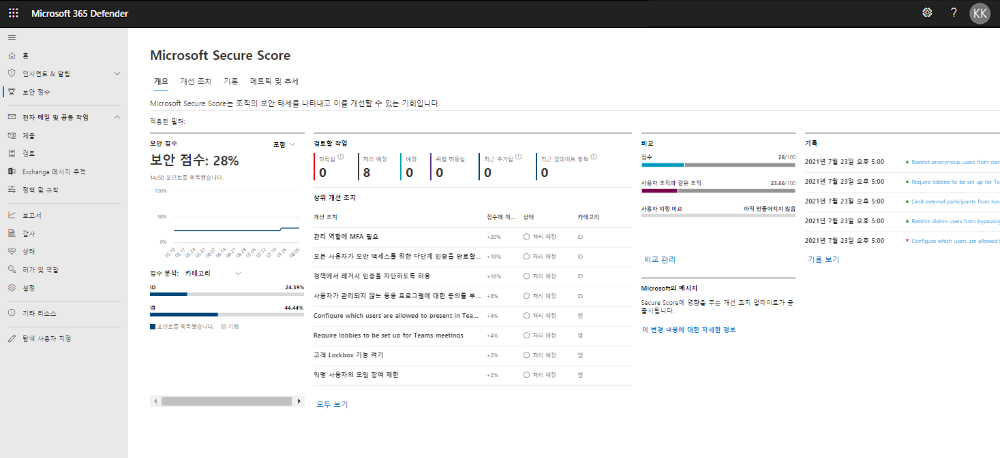

# 모듈 4: 랩 1 - 연습 1 - Microsoft 365 보안 센터에서 보안 점수 높이기

이 연습에서 여러분은 전역 관리자인 Holly Dickson 역할을 맡아 작업을 진행합니다. 연습을 진행하려면 Microsoft 365에 로그인합니다.

보안 이점을 제공하는 서비스가 너무 많기 때문에 Holly는 조직 배포를 보호하기 위해 먼저 수행해야 하는 단계를 파악하기가 어려운 경우가 많습니다. Microsoft Secure Score는 Holly에게 적용되는 보안 권장 사항을 검토하여 우선 순위를 지정하므로, 우선적으로 수행해야 하는 권장 사항을 파악할 수 있습니다. 이 연습에서 Holly는 조직의 Microsoft Secure Score를 확인한 다음 포털을 사용하여 점수를 높이기 위한 권장 작업을 수행합니다.

**보안 점수 계산**

Security Center는 보안 권장 사항을 검토하고 고급 알고리즘을 적용하여 각 권장 사항의 중요도를 판별하는 보안 분석가의 작업을 모방합니다.

Microsoft Security Center는 활성 권장 사항을 지속적으로 검토한 다음 이 권장 사항을 기준으로 보안 점수를 계산합니다. 권장 사항의 점수는 워크로드 보안에 가장 큰 영향을 주는 보안 모범 사례와 심각도를 토대로 결정됩니다.

### 작업 1: Microsoft 365 보안 포털에서 보안 점수 확인.

1.  **LON-CL1** 가상 머신에 Administrator로 로그인합니다(암호: `Pa55w.rd`).  Microsoft 365 보안 대시보드 `https://security.microsoft.com`으로 이동한 다음 Holly의 전역 관리자 자격 증명을 사용하여 로그인합니다. 그런 후에 대시보드에서 **Microsoft Secure Score** 를 선택합니다.

2.  화면 위쪽에 보안 점수 관련 주요 정보가 표시됩니다.

       - **Secure Score** 는 선택한 구독의 정책별 점수에 해당됩니다.
       - 범주별 보안 점수에는 가장 시급하게 확인해야 하는 리소스가 표시됩니다.
 
       

    
      **참고**: 각 구독의 보안 점수 합계가 전체 보안 점수와 같지는 않습니다. 보안 점수는 구독 전체의 보안 점수를 합한 값이 아니라 권장 사항당 총 리소스와 정상 리소스 간의 비율을 기준으로 계산된 값입니다. 

3.  **개선 조치** 를 선택하여 해당 구독의 보안 점수를 높이기 위해 수행할 수 있는 조치를 확인합니다.

4.  조치 목록의 각 조치에는 **획득한 점수** 열이 있습니다. 이 점수는 해당 조치를 취하면 획득할 수 있는 점수에 해당됩니다. 예를 들어 아래 화면에서 **관리 역할에 MFA 필요** 를 선택하면 최대 10점을 획득할 수 있습니다.

### 작업 2: Microsoft Secure Score 기록 확인.

보안 점수 기록도 확인할 수 있습니다. 기록을 확인하려면 **기록** 옵션을 클릭합니다.  

보기의 기간(일) 범위를 사용자 지정할 수 있으며, 특정 보안 점수 범주만 표시되도록 설정할 수도 있습니다.  이렇게 하면 시간별 보안 태세 변경 추이를 파악할 수 있습니다.

보안 점수 기록 보기에는 점수를 높이기 위해 취한 특정 조치, 그리고 해당 조치에 따른 점수 변화도 표시됩니다.

### 작업 3: 보안 점수 향상

1.  **개선 조치** 탭을 클릭하고 **셀프 서비스 암호 재설정 사용** 을 선택합니다. 이 보안 조치와 관련된 자세한 정보가 표시됩니다. 이 정보에는 해당 조치를 취할 수 있는 구체적인 지침도 포함되어 있습니다.

2.  **Microsoft Azure 관리** 단추를 클릭합니다.  새 브라우저 탭이 열리고 Azure Portal의 **암호 재설정 - 속성** 블레이드가 바로 표시됩니다.
  
3.  **셀프 서비스 암호 재설정이 사용하도록 설정됨** 에서 모두를 클릭합니다. 

4.  이전 랩에서 해당 옵션을 모두로 설정하지 않은 경우 **저장** 을 클릭합니다.

5.  관리 영역에서 **등록** 을 클릭합니다.

6.  “로그인할 때 사용자가 등록하도록 요구하나요?” 가 **예** 로 표시되어 있는지 확인합니다.
 
7.  사용자에게 해당 인증 정보를 다시 확인하도록 요청하기까지의 기간을 `90`으로 변경합니다.

8.  **저장** 을 클릭합니다.

9.  Microsoft Secure Score가 표시된 브라우저 탭으로 돌아옵니다.

10. 셀프 서비스 암호 재설정 사용 창의 메모에 **<오늘 날짜 입력>에 모든 사용자에 대해 셀프 서비스 암호 재설정을 사용하도록 설정함** 을 입력하고 **저장 후 닫기** 를 클릭합니다.

**참고:**  업데이트한 점수가 Microsoft Secure Score에 표시되려면 24시간이 걸릴 수 있습니다.  그리고 조치에 따라 점수가 일부분만 부여될 수도 있습니다.  예를 들어 사용이 허가된 사용자는 10명인데 그 중 2명만 셀프 서비스 암호 재설정을 사용하도록 설정한 테넌트의 경우에는 해당 조치에 따른 점수 중 1/5만 부여됩니다.

24시간 후에 Microsoft Secure Score를 다시 방문하여 변경된 점수를 확인하고 기록 탭도 다시 살펴봅니다.

**결과**: 이 랩에서는 Microsoft Security Center에서 보안 점수를 높이는 방법을 알아보았습니다.

# 랩 종료 
